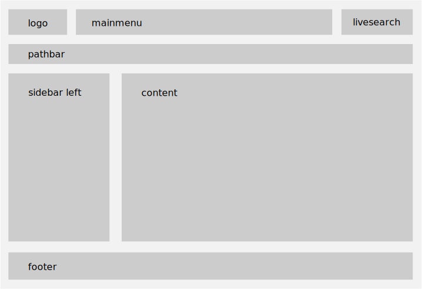

======
Layout
======

.. _layout_main_template:

Main Template
-------------

The main template of ``cone.app`` can be altered by overriding
``cone.app.cfg.main_template``.

.. code-block:: python

    import cone.app

    cone.app.cfg.main_template = 'cone.example.browser:templates/main.pt'

Alternatively, the main template can be defined in the Application ini config
file::

.. code-block:: ini

    [app:example]
    cone.main_template = cone.example.browser:templates/main.pt

Application Layout
------------------

The main layout of the application is implemented as tile with name ``layout``.

The referring template lives in ``cone.app.browser:templates/layout.pt`` and
is structured as follows.

The layout can be configured for each application node. Layout configuration
is described in ``cone.app.interfaces.ILayoutConfig`` and is registered for
one or more model classes with ``cone.app.layout_config`` decorator.

.. code-block:: python

    from cone.app import layout_config
    from cone.app.model import BaseNode
    from cone.app.model import LayoutConfig

    class CustomNodeOne(BaseNode):
        pass

    class CustomNodeTwo(BaseNode):
        pass

    @layout_config(CustomNodeOne, CustomNodeTwo)
    class CustomLayoutConfig(LayoutConfig)

        def __init__(self, model, request):
            super(ExampleNodeLayoutConfig, self).__init__(model, request)
            self.mainmenu = True
            self.mainmenu_fluid = False
            self.livesearch = True
            self.personaltools = True
            self.columns_fluid = False
            self.pathbar = True
            self.sidebar_left = ['navtree']
            self.sidebar_left_grid_width = 3
            self.content_grid_width = 9

Provided layout settings:

- **mainmenu**: Flag whether to display mainmenu.

- **mainmenu_fluid**: Flag whether mainmenu is fluid.

- **livesearch**: Flag whether to display livesearch.

- **personaltools**: Flag whether to display personaltools.

- **columns_fluid**: Flag whether columns are fluid.

- **pathbar**: Flag whether to display pathbar.

- **sidebar_left**: List of tiles by name which should be rendered in sidebar.

- **sidebar_left_grid_width**: Sidebar grid width as integer, total grid width
  is 12.

- **content_grid_width**: Content grid width as integer, total grid width
  is 12.

.. note::

    As of version 1.1, ``mainmenu_fluid`` defaults to ``True``.

.. deprecated:: 1.1

    Prior to ``cone.app 1.1``, layout configuration could be done via the
    ``layout`` property on application model nodes or with an ``ILayout``
    implementing adapter. These patterns are deprecated. See the
    :ref:`Migration <migration_deprecated_patterns>` appendix for details.

    Use ``LayoutConfig`` and the ``layout_config`` decorator instead.
