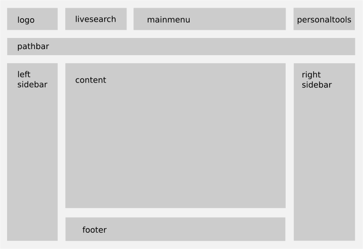

======
Layout
======

.. version-added:: 2.0

    Version 2.0 introduces a new, more flexible layout system and the ``sidebar_right``
    and ``personaltools`` elements.

    There are new layout configuration settings available. See
    :ref:`layout_configuration` for details.

.. _layout_main_template:

Main Template
-------------

The main template of ``cone.app`` can be altered by overriding
``cone.app.cfg.main_template``.

.. code-block:: python

    import cone.app

    cone.app.cfg.main_template = 'cone.example.browser:templates/main.pt'

Alternatively, the main template can be defined in the Application ini config
file::

.. code-block:: ini

    [app:example]
    cone.main_template = cone.example.browser:templates/main.pt

Application Layout
------------------

The main layout of the application is implemented as tile with name ``layout``.

The referring template lives in ``cone.app.browser:templates/layout.pt`` and
is structured as follows.

.. _layout_configuration:

Layout Configuration
--------------------

The layout can be configured for each application node. Layout configuration
is described in ``cone.app.interfaces.ILayoutConfig`` and is registered for
one or more model classes with ``cone.app.layout_config`` decorator.

.. code-block:: python

    from cone.app import layout_config
    from cone.app.model import BaseNode
    from cone.app.model import LayoutConfig

    class CustomNodeOne(BaseNode):
        pass

    class CustomNodeTwo(BaseNode):
        pass

    @layout_config(CustomNodeOne, CustomNodeTwo)
    class CustomLayoutConfig(LayoutConfig):

        def __init__(self, model, request):
            super(CustomLayoutConfig, self).__init__(model, request)
            self.mainmenu = True
            self.livesearch = True
            self.personaltools = True
            self.limit_content_width = False
            self.pathbar = True
            self.sidebar_left = ['navtree']
            self.sidebar_right = ['my_tile']
            self.sidebar_left_min_width = 250
            self.sidebar_right_min_width = 250

.. list-table:: Layout Configuration Settings
  :widths: 20 60 20
  :header-rows: 1

  * - Setting
    - Description
    - Default
  * - ``mainmenu``
    - Flag whether to display mainmenu.
    - True
  * - ``livesearch``
    - Flag whether to display livesearch.
    - True
  * - ``personaltools``
    - Flag whether to display personaltools.
    - True
  * - ``limit_content_width``
    - Flag whether content width should be limited on large screens.
    - True
  * - ``pathbar``
    - Flag whether to display pathbar.
    - True
  * - ``sidebar_left``
    - List of tiles by name which should be rendered in left sidebar.
    - ['navtree']
  * - ``sidebar_left_mode``
    - The mode of the left sidebar (``'stacked'`` or ``'toggle'``).
    - 'stacked'
  * - ``sidebar_left_min_width``
    - Minimum left sidebar width as integer (in px).
    - 150
  * - ``sidebar_right``
    - List of tiles by name which should be rendered in right sidebar.
    - []
  * - ``sidebar_right_mode``
    - The mode of the right sidebar (``'stacked'`` or ``'toggle'``).
    - 'stacked'
  * - ``sidebar_right_min_width``
    - Minimum right sidebar width as integer (in px).
    - 150

.. version-added:: 2.0

    - The ``sidebar_left_min_width`` and ``sidebar_right_min_width`` settings have been
      added to specify minimum sidebar widths in px.
    - The ``sidebar_left_mode`` and ``sidebar_right_mode`` settings have been
      added to specify sidebar modes (either ``'stacked'`` or ``'toggle'``).
    - The ``limit_content_width`` setting has been added to replace the former
      ``columns_fluid`` setting.
    - As of version 2.0, ``limit_content_width`` defaults to ``True``.

.. version-removed:: 2.0

    ``mainmenu_fluid``, ``columns_fluid``, ``sidebar_left_grid_width`` and 
    ``content_grid_width`` have been removed in ``cone.app 2.0`` in favor of a
    more flexible layout.
    Use the ``limit_content_width`` setting instead to limit content width on
    large screens.

.. deprecated:: 1.1

    Prior to ``cone.app 1.1``, layout configuration could be done via the
    ``layout`` property on application model nodes or with an ``ILayout``
    implementing adapter. These patterns are deprecated. See the
    :ref:`Migration <migration_deprecated_patterns>` appendix for details.

    Use ``LayoutConfig`` and the ``layout_config`` decorator instead.
